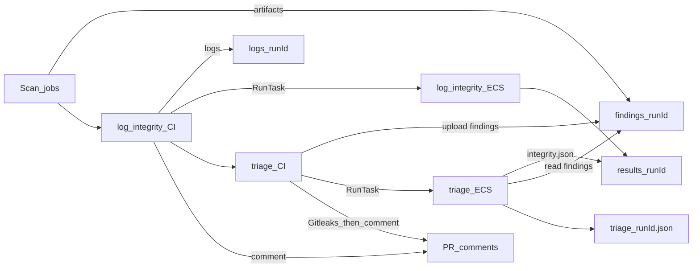

# Architecture

Secure CI/CD lab: long-lived AWS infra + ephemeral ECS Fargate agents that
review pipeline outcomes. Agents never hold a GitHub token.

## Flow

## Components

| Piece | Location |
|-------|----------|
| Workflow | [`.github/workflows/security-pipeline.yml`](../.github/workflows/security-pipeline.yml) |
| Log-integrity agent | [`agent/log-integrity-agent/`](../agent/log-integrity-agent/) |
| Triage agent | [`agent/triage-agent/`](../agent/triage-agent/) |
| Terraform | [`terraform/`](../terraform/) |

## S3 audit bucket prefixes

| Prefix | Writer | Reader |
|--------|--------|--------|
| `logs/<run_id>/` | GHA (job logs + manifest) | log-integrity ECS |
| `results/<run_id>/<sha>.md` | log-integrity ECS | GHA (PR comment) |
| `results/<run_id>/integrity.json` | log-integrity ECS | triage ECS (gate) |
| `findings/<run_id>/` | GHA (SARIF/JSON artifacts) | triage ECS |
| `triage/<run_id>.json` | triage ECS | GHA (Gitleaks + PR comment) |

## Agents

Both tasks share: ECS cluster, private subnet, security group, execution role,
task role (additive statements), LLM Secrets Manager secret, CloudWatch log
group (different `awslogs-stream-prefix`).

- **Log-integrity:** compares reported job conclusions vs log bodies; writes Markdown + `integrity.json`.
- **Triage:** refuses to run unless `integrity.json` has `"passed": true`; one LLM call per finding; writes JSON summary. CI Gitleaks blocks publish on hits.

## Cost pause

NAT Gateway + its Elastic IP are the main always-on cost. Delete NAT, then
release the EIP. Recreate with `terraform apply` when resuming. Other lab
resources are cheap or free when idle.

## Secrets (GitHub)

Among others: `AWS_ROLE_ARN`, `AWS_REGION`, `ECS_CLUSTER`,
`ECS_TASK_DEFINITION`, `ECS_TRIAGE_TASK_DEFINITION`, `ECS_SUBNET_ID`,
`ECS_SECURITY_GROUP_ID`, `AUDIT_BUCKET_NAME`, `LLM_API_KEY_SECRET_ARN`.
